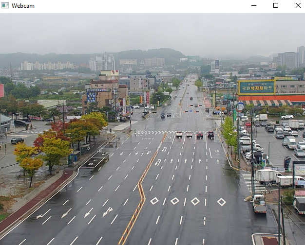
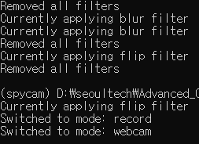
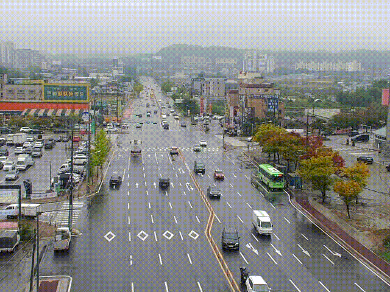

[[Project]](https://github.com/zachnguyen03/opencv_spycam)

# OpenCV Spycam - Official Implementation
This is the official code of the OpenCV Spycam mini-app

## **Requirements**
-opencv-python>=4.9.0.80

## **Initialzing spycam**
1. Webcam mode
`python main.py`

## **Parameters**
1. **IP address**: used to specify the destination for cv2.VideoCapture
- Set to 0: OpenCV capture your computer's webcam
- Set to a RTSP address: OpenCV captures the camera (e.g CCTV) from the specified RTSP IP address
2. **Codec**: specify the codec which cv2.VideoWriter uses to make the output video
- Available codecs: 'MJPG' (recommended for 'avi'), 'DVIX', 'MP4V' 
3. **FPS**: specify the FPS of the output video (default: 10.0)
4. **Mode**: specify the starting mode of the VideoCapture (default: webcam)
- This mode can be changed during the capture by pressing SPACE key 
- PREVIEW mode: show preview of the cam on the monitor
- RECORD mode: record the video and save it to save_path

## **Features**
1. Applying filter to VideoCapture
- Currently support the following filters: GaussianBlur, Flip
- Press B key to apply Blur, press F key to flip the current video
- Press R key to remove all filters
- 참고: the keys response time is a bit slow, might need to press 2-3 times to apply/remove the filter
2. Flexibly initialize cam with specific FPS, Codec:
`python main.py --mode webcam --ip [IP] --fps [FPS] --codec [CODEC] --save_path [SAVE_PATH]` with the desired values

## Screenshots
1. **Webcam interface**  

2. **Command line notifications (switch modes, apply filters)**  

3. **Output video**  
